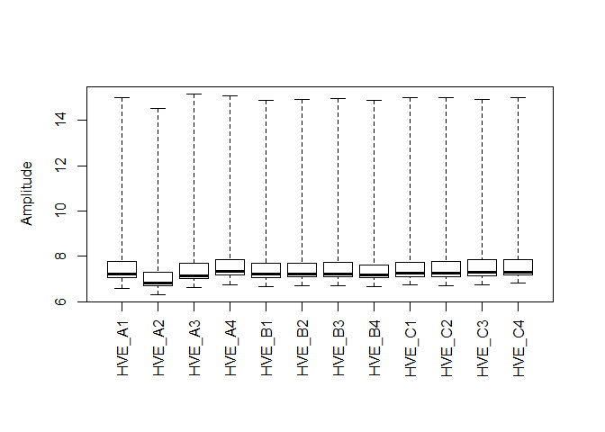

Exosome Microarray Analysis: HVE cells only
================
Claire Levy
January 13, 2017

Experiment overview
-------------------

Experiments were done on two cells types: Langerhans cells and vaginal epithelial cells.

HVE cells were exposed to the following:

-   High concentration of exosomes ("HighExosomes")
-   Low concentration of exosomes ("LowExosomes")
-   Seminal supernatant
-   Media control

The following analysis is only for HVE cells
--------------------------------------------

    ## Inputting the data ...
    ## Perform Quality Control assessment of the LumiBatch object ...

Plots of non-normalized data: HVE\_A2 appears as the main outlier, it is donor A with no virus and low exosomes. 

Plots of quantile normalized data

    ## Perform quantile normalization ...

FILTERING PROBES Limma suggests to keep probes that are expressed above background on at least n arrays where n is smallest number of replicates assigned to any of the treatment combinations.

We have 3 donors x 4 Treatments so I will keep probes with detection levels above background in at least 3 samples.

Number of probes in data set before filtering:

    ##          beadNum detection exprs se.exprs
    ## Features   47323     47323 47323    47323
    ## Samples       12        12    12       12

Numbers of probes in data set after filtering:

    ##          beadNum detection exprs se.exprs
    ## Features   20619     20619 20619    20619
    ## Samples       12        12    12       12

How many DE probes were in each contrast?

<table style="width:40%;">
<colgroup>
<col width="25%" />
<col width="9%" />
<col width="5%" />
</colgroup>
<thead>
<tr class="header">
<th align="center">variable</th>
<th align="center">down</th>
<th align="center">up</th>
</tr>
</thead>
<tbody>
<tr class="odd">
<td align="center">MediaVsLowExos</td>
<td align="center">0</td>
<td align="center">0</td>
</tr>
<tr class="even">
<td align="center">MediaVsHighExos</td>
<td align="center">0</td>
<td align="center">0</td>
</tr>
<tr class="odd">
<td align="center">MediaVsSup</td>
<td align="center">0</td>
<td align="center">13</td>
</tr>
<tr class="even">
<td align="center">LowExosVsHighExos</td>
<td align="center">0</td>
<td align="center">0</td>
</tr>
</tbody>
</table>

CAMERA testing
--------------

Hallmark gene sets: top 6 results
=================================

Media Vs Low Exos

<table>
<caption>Table continues below</caption>
<colgroup>
<col width="62%" />
<col width="11%" />
<col width="15%" />
<col width="10%" />
</colgroup>
<thead>
<tr class="header">
<th align="center"> </th>
<th align="center">NGenes</th>
<th align="center">Direction</th>
<th align="center">PValue</th>
</tr>
</thead>
<tbody>
<tr class="odd">
<td align="center"><strong>HALLMARK_ANDROGEN_RESPONSE</strong></td>
<td align="center">120</td>
<td align="center">Down</td>
<td align="center">0.01439</td>
</tr>
<tr class="even">
<td align="center"><strong>HALLMARK_ESTROGEN_RESPONSE_LATE</strong></td>
<td align="center">213</td>
<td align="center">Down</td>
<td align="center">0.03448</td>
</tr>
<tr class="odd">
<td align="center"><strong>HALLMARK_EPITHELIAL_MESENCHYMAL_TRANSITION</strong></td>
<td align="center">196</td>
<td align="center">Up</td>
<td align="center">0.04073</td>
</tr>
<tr class="even">
<td align="center"><strong>HALLMARK_MTORC1_SIGNALING</strong></td>
<td align="center">291</td>
<td align="center">Down</td>
<td align="center">0.05753</td>
</tr>
<tr class="odd">
<td align="center"><strong>HALLMARK_SPERMATOGENESIS</strong></td>
<td align="center">103</td>
<td align="center">Down</td>
<td align="center">0.07578</td>
</tr>
<tr class="even">
<td align="center"><strong>HALLMARK_CHOLESTEROL_HOMEOSTASIS</strong></td>
<td align="center">93</td>
<td align="center">Down</td>
<td align="center">0.09002</td>
</tr>
</tbody>
</table>

<table style="width:76%;">
<colgroup>
<col width="68%" />
<col width="8%" />
</colgroup>
<thead>
<tr class="header">
<th align="center"> </th>
<th align="center">FDR</th>
</tr>
</thead>
<tbody>
<tr class="odd">
<td align="center"><strong>HALLMARK_ANDROGEN_RESPONSE</strong></td>
<td align="center">0.6428</td>
</tr>
<tr class="even">
<td align="center"><strong>HALLMARK_ESTROGEN_RESPONSE_LATE</strong></td>
<td align="center">0.6428</td>
</tr>
<tr class="odd">
<td align="center"><strong>HALLMARK_EPITHELIAL_MESENCHYMAL_TRANSITION</strong></td>
<td align="center">0.6428</td>
</tr>
<tr class="even">
<td align="center"><strong>HALLMARK_MTORC1_SIGNALING</strong></td>
<td align="center">0.6428</td>
</tr>
<tr class="odd">
<td align="center"><strong>HALLMARK_SPERMATOGENESIS</strong></td>
<td align="center">0.6428</td>
</tr>
<tr class="even">
<td align="center"><strong>HALLMARK_CHOLESTEROL_HOMEOSTASIS</strong></td>
<td align="center">0.6428</td>
</tr>
</tbody>
</table>

Media Vs High Exos

<table>
<caption>Table continues below</caption>
<colgroup>
<col width="62%" />
<col width="11%" />
<col width="15%" />
<col width="11%" />
</colgroup>
<thead>
<tr class="header">
<th align="center"> </th>
<th align="center">NGenes</th>
<th align="center">Direction</th>
<th align="center">PValue</th>
</tr>
</thead>
<tbody>
<tr class="odd">
<td align="center"><strong>HALLMARK_EPITHELIAL_MESENCHYMAL_TRANSITION</strong></td>
<td align="center">196</td>
<td align="center">Up</td>
<td align="center">2.554e-05</td>
</tr>
<tr class="even">
<td align="center"><strong>HALLMARK_UV_RESPONSE_DN</strong></td>
<td align="center">169</td>
<td align="center">Up</td>
<td align="center">0.05217</td>
</tr>
<tr class="odd">
<td align="center"><strong>HALLMARK_WNT_BETA_CATENIN_SIGNALING</strong></td>
<td align="center">47</td>
<td align="center">Up</td>
<td align="center">0.06382</td>
</tr>
<tr class="even">
<td align="center"><strong>HALLMARK_G2M_CHECKPOINT</strong></td>
<td align="center">270</td>
<td align="center">Up</td>
<td align="center">0.1555</td>
</tr>
<tr class="odd">
<td align="center"><strong>HALLMARK_IL2_STAT5_SIGNALING</strong></td>
<td align="center">204</td>
<td align="center">Up</td>
<td align="center">0.1671</td>
</tr>
<tr class="even">
<td align="center"><strong>HALLMARK_MYOGENESIS</strong></td>
<td align="center">169</td>
<td align="center">Up</td>
<td align="center">0.192</td>
</tr>
</tbody>
</table>

<table style="width:79%;">
<colgroup>
<col width="68%" />
<col width="11%" />
</colgroup>
<thead>
<tr class="header">
<th align="center"> </th>
<th align="center">FDR</th>
</tr>
</thead>
<tbody>
<tr class="odd">
<td align="center"><strong>HALLMARK_EPITHELIAL_MESENCHYMAL_TRANSITION</strong></td>
<td align="center">0.001277</td>
</tr>
<tr class="even">
<td align="center"><strong>HALLMARK_UV_RESPONSE_DN</strong></td>
<td align="center">0.9369</td>
</tr>
<tr class="odd">
<td align="center"><strong>HALLMARK_WNT_BETA_CATENIN_SIGNALING</strong></td>
<td align="center">0.9369</td>
</tr>
<tr class="even">
<td align="center"><strong>HALLMARK_G2M_CHECKPOINT</strong></td>
<td align="center">0.9369</td>
</tr>
<tr class="odd">
<td align="center"><strong>HALLMARK_IL2_STAT5_SIGNALING</strong></td>
<td align="center">0.9369</td>
</tr>
<tr class="even">
<td align="center"><strong>HALLMARK_MYOGENESIS</strong></td>
<td align="center">0.9369</td>
</tr>
</tbody>
</table>

Media Vs Sup

<table>
<caption>Table continues below</caption>
<colgroup>
<col width="61%" />
<col width="11%" />
<col width="15%" />
<col width="11%" />
</colgroup>
<thead>
<tr class="header">
<th align="center"> </th>
<th align="center">NGenes</th>
<th align="center">Direction</th>
<th align="center">PValue</th>
</tr>
</thead>
<tbody>
<tr class="odd">
<td align="center"><strong>HALLMARK_REACTIVE_OXIGEN_SPECIES_PATHWAY</strong></td>
<td align="center">71</td>
<td align="center">Up</td>
<td align="center">3.363e-08</td>
</tr>
<tr class="even">
<td align="center"><strong>HALLMARK_XENOBIOTIC_METABOLISM</strong></td>
<td align="center">189</td>
<td align="center">Up</td>
<td align="center">0.0008128</td>
</tr>
<tr class="odd">
<td align="center"><strong>HALLMARK_MYC_TARGETS_V1</strong></td>
<td align="center">303</td>
<td align="center">Up</td>
<td align="center">0.005873</td>
</tr>
<tr class="even">
<td align="center"><strong>HALLMARK_MTORC1_SIGNALING</strong></td>
<td align="center">291</td>
<td align="center">Up</td>
<td align="center">0.01295</td>
</tr>
<tr class="odd">
<td align="center"><strong>HALLMARK_FATTY_ACID_METABOLISM</strong></td>
<td align="center">177</td>
<td align="center">Up</td>
<td align="center">0.01933</td>
</tr>
<tr class="even">
<td align="center"><strong>HALLMARK_CHOLESTEROL_HOMEOSTASIS</strong></td>
<td align="center">93</td>
<td align="center">Down</td>
<td align="center">0.02284</td>
</tr>
</tbody>
</table>

<table style="width:78%;">
<colgroup>
<col width="65%" />
<col width="12%" />
</colgroup>
<thead>
<tr class="header">
<th align="center"> </th>
<th align="center">FDR</th>
</tr>
</thead>
<tbody>
<tr class="odd">
<td align="center"><strong>HALLMARK_REACTIVE_OXIGEN_SPECIES_PATHWAY</strong></td>
<td align="center">1.681e-06</td>
</tr>
<tr class="even">
<td align="center"><strong>HALLMARK_XENOBIOTIC_METABOLISM</strong></td>
<td align="center">0.02032</td>
</tr>
<tr class="odd">
<td align="center"><strong>HALLMARK_MYC_TARGETS_V1</strong></td>
<td align="center">0.09788</td>
</tr>
<tr class="even">
<td align="center"><strong>HALLMARK_MTORC1_SIGNALING</strong></td>
<td align="center">0.1619</td>
</tr>
<tr class="odd">
<td align="center"><strong>HALLMARK_FATTY_ACID_METABOLISM</strong></td>
<td align="center">0.1904</td>
</tr>
<tr class="even">
<td align="center"><strong>HALLMARK_CHOLESTEROL_HOMEOSTASIS</strong></td>
<td align="center">0.1904</td>
</tr>
</tbody>
</table>

Low Exos Vs High Exos

<table>
<caption>Table continues below</caption>
<colgroup>
<col width="62%" />
<col width="11%" />
<col width="15%" />
<col width="10%" />
</colgroup>
<thead>
<tr class="header">
<th align="center"> </th>
<th align="center">NGenes</th>
<th align="center">Direction</th>
<th align="center">PValue</th>
</tr>
</thead>
<tbody>
<tr class="odd">
<td align="center"><strong>HALLMARK_UV_RESPONSE_DN</strong></td>
<td align="center">169</td>
<td align="center">Up</td>
<td align="center">0.001146</td>
</tr>
<tr class="even">
<td align="center"><strong>HALLMARK_MITOTIC_SPINDLE</strong></td>
<td align="center">243</td>
<td align="center">Up</td>
<td align="center">0.006924</td>
</tr>
<tr class="odd">
<td align="center"><strong>HALLMARK_APICAL_JUNCTION</strong></td>
<td align="center">223</td>
<td align="center">Up</td>
<td align="center">0.01682</td>
</tr>
<tr class="even">
<td align="center"><strong>HALLMARK_EPITHELIAL_MESENCHYMAL_TRANSITION</strong></td>
<td align="center">196</td>
<td align="center">Up</td>
<td align="center">0.01876</td>
</tr>
<tr class="odd">
<td align="center"><strong>HALLMARK_IL2_STAT5_SIGNALING</strong></td>
<td align="center">204</td>
<td align="center">Up</td>
<td align="center">0.02484</td>
</tr>
<tr class="even">
<td align="center"><strong>HALLMARK_ANDROGEN_RESPONSE</strong></td>
<td align="center">120</td>
<td align="center">Up</td>
<td align="center">0.02547</td>
</tr>
</tbody>
</table>

<table style="width:78%;">
<colgroup>
<col width="68%" />
<col width="9%" />
</colgroup>
<thead>
<tr class="header">
<th align="center"> </th>
<th align="center">FDR</th>
</tr>
</thead>
<tbody>
<tr class="odd">
<td align="center"><strong>HALLMARK_UV_RESPONSE_DN</strong></td>
<td align="center">0.05732</td>
</tr>
<tr class="even">
<td align="center"><strong>HALLMARK_MITOTIC_SPINDLE</strong></td>
<td align="center">0.1731</td>
</tr>
<tr class="odd">
<td align="center"><strong>HALLMARK_APICAL_JUNCTION</strong></td>
<td align="center">0.2063</td>
</tr>
<tr class="even">
<td align="center"><strong>HALLMARK_EPITHELIAL_MESENCHYMAL_TRANSITION</strong></td>
<td align="center">0.2063</td>
</tr>
<tr class="odd">
<td align="center"><strong>HALLMARK_IL2_STAT5_SIGNALING</strong></td>
<td align="center">0.2063</td>
</tr>
<tr class="even">
<td align="center"><strong>HALLMARK_ANDROGEN_RESPONSE</strong></td>
<td align="center">0.2063</td>
</tr>
</tbody>
</table>

GO gene sets: top 6 results
===========================

Media Vs Low Exos

<table>
<caption>Table continues below</caption>
<colgroup>
<col width="74%" />
<col width="11%" />
<col width="14%" />
</colgroup>
<thead>
<tr class="header">
<th align="center"> </th>
<th align="center">NGenes</th>
<th align="center">Direction</th>
</tr>
</thead>
<tbody>
<tr class="odd">
<td align="center"><strong>GO_DESMOSOME</strong></td>
<td align="center">42</td>
<td align="center">Down</td>
</tr>
<tr class="even">
<td align="center"><strong>GO_CORNIFIED_ENVELOPE</strong></td>
<td align="center">35</td>
<td align="center">Down</td>
</tr>
<tr class="odd">
<td align="center"><strong>GO_PEPTIDE_CROSS_LINKING</strong></td>
<td align="center">35</td>
<td align="center">Down</td>
</tr>
<tr class="even">
<td align="center"><strong>GO_KERATINOCYTE_DIFFERENTIATION</strong></td>
<td align="center">89</td>
<td align="center">Down</td>
</tr>
<tr class="odd">
<td align="center"><strong>GO_POSITIVE_REGULATION_OF_MYOBLAST_DIFFERENTIATION</strong></td>
<td align="center">17</td>
<td align="center">Down</td>
</tr>
<tr class="even">
<td align="center"><strong>GO_REGULATION_OF_ACTIN_FILAMENT_BASED_MOVEMENT</strong></td>
<td align="center">30</td>
<td align="center">Down</td>
</tr>
</tbody>
</table>

<table>
<colgroup>
<col width="74%" />
<col width="12%" />
<col width="12%" />
</colgroup>
<thead>
<tr class="header">
<th align="center"> </th>
<th align="center">PValue</th>
<th align="center">FDR</th>
</tr>
</thead>
<tbody>
<tr class="odd">
<td align="center"><strong>GO_DESMOSOME</strong></td>
<td align="center">2.157e-07</td>
<td align="center">0.000816</td>
</tr>
<tr class="even">
<td align="center"><strong>GO_CORNIFIED_ENVELOPE</strong></td>
<td align="center">2.648e-07</td>
<td align="center">0.000816</td>
</tr>
<tr class="odd">
<td align="center"><strong>GO_PEPTIDE_CROSS_LINKING</strong></td>
<td align="center">1.986e-05</td>
<td align="center">0.04079</td>
</tr>
<tr class="even">
<td align="center"><strong>GO_KERATINOCYTE_DIFFERENTIATION</strong></td>
<td align="center">3.779e-05</td>
<td align="center">0.05618</td>
</tr>
<tr class="odd">
<td align="center"><strong>GO_POSITIVE_REGULATION_OF_MYOBLAST_DIFFERENTIATION</strong></td>
<td align="center">4.558e-05</td>
<td align="center">0.05618</td>
</tr>
<tr class="even">
<td align="center"><strong>GO_REGULATION_OF_ACTIN_FILAMENT_BASED_MOVEMENT</strong></td>
<td align="center">6.611e-05</td>
<td align="center">0.06754</td>
</tr>
</tbody>
</table>

Media Vs High Exos

<table>
<caption>Table continues below</caption>
<colgroup>
<col width="73%" />
<col width="11%" />
<col width="14%" />
</colgroup>
<thead>
<tr class="header">
<th align="center"> </th>
<th align="center">NGenes</th>
<th align="center">Direction</th>
</tr>
</thead>
<tbody>
<tr class="odd">
<td align="center"><strong>GO_CORNIFIED_ENVELOPE</strong></td>
<td align="center">35</td>
<td align="center">Down</td>
</tr>
<tr class="even">
<td align="center"><strong>GO_PEPTIDE_CROSS_LINKING</strong></td>
<td align="center">35</td>
<td align="center">Down</td>
</tr>
<tr class="odd">
<td align="center"><strong>GO_KERATINIZATION</strong></td>
<td align="center">39</td>
<td align="center">Down</td>
</tr>
<tr class="even">
<td align="center"><strong>GO_MEIOTIC_CHROMOSOME_SEPARATION</strong></td>
<td align="center">9</td>
<td align="center">Down</td>
</tr>
<tr class="odd">
<td align="center"><strong>GO_ADA2_GCN5_ADA3_TRANSCRIPTION_ACTIVATOR_COMPLEX</strong></td>
<td align="center">22</td>
<td align="center">Up</td>
</tr>
<tr class="even">
<td align="center"><strong>GO_KERATINOCYTE_DIFFERENTIATION</strong></td>
<td align="center">89</td>
<td align="center">Down</td>
</tr>
</tbody>
</table>

<table style="width:100%;">
<colgroup>
<col width="73%" />
<col width="13%" />
<col width="13%" />
</colgroup>
<thead>
<tr class="header">
<th align="center"> </th>
<th align="center">PValue</th>
<th align="center">FDR</th>
</tr>
</thead>
<tbody>
<tr class="odd">
<td align="center"><strong>GO_CORNIFIED_ENVELOPE</strong></td>
<td align="center">1.225e-07</td>
<td align="center">0.000755</td>
</tr>
<tr class="even">
<td align="center"><strong>GO_PEPTIDE_CROSS_LINKING</strong></td>
<td align="center">7.879e-07</td>
<td align="center">0.002428</td>
</tr>
<tr class="odd">
<td align="center"><strong>GO_KERATINIZATION</strong></td>
<td align="center">1.185e-06</td>
<td align="center">0.002434</td>
</tr>
<tr class="even">
<td align="center"><strong>GO_MEIOTIC_CHROMOSOME_SEPARATION</strong></td>
<td align="center">0.0004517</td>
<td align="center">0.5449</td>
</tr>
<tr class="odd">
<td align="center"><strong>GO_ADA2_GCN5_ADA3_TRANSCRIPTION_ACTIVATOR_COMPLEX</strong></td>
<td align="center">0.0004902</td>
<td align="center">0.5449</td>
</tr>
<tr class="even">
<td align="center"><strong>GO_KERATINOCYTE_DIFFERENTIATION</strong></td>
<td align="center">0.0006173</td>
<td align="center">0.5449</td>
</tr>
</tbody>
</table>

Media Vs Sup

<table>
<colgroup>
<col width="50%" />
<col width="10%" />
<col width="14%" />
<col width="12%" />
<col width="12%" />
</colgroup>
<thead>
<tr class="header">
<th align="center"> </th>
<th align="center">NGenes</th>
<th align="center">Direction</th>
<th align="center">PValue</th>
<th align="center">FDR</th>
</tr>
</thead>
<tbody>
<tr class="odd">
<td align="center"><strong>GO_CELLULAR_RESPONSE_TO_CADMIUM_ION</strong></td>
<td align="center">12</td>
<td align="center">Up</td>
<td align="center">3.085e-11</td>
<td align="center">1.901e-07</td>
</tr>
<tr class="even">
<td align="center"><strong>GO_CORNIFIED_ENVELOPE</strong></td>
<td align="center">35</td>
<td align="center">Down</td>
<td align="center">1.388e-10</td>
<td align="center">4.277e-07</td>
</tr>
<tr class="odd">
<td align="center"><strong>GO_PEPTIDE_CROSS_LINKING</strong></td>
<td align="center">35</td>
<td align="center">Down</td>
<td align="center">6.573e-10</td>
<td align="center">1.35e-06</td>
</tr>
<tr class="even">
<td align="center"><strong>GO_CYCLOOXYGENASE_PATHWAY</strong></td>
<td align="center">9</td>
<td align="center">Up</td>
<td align="center">1.504e-07</td>
<td align="center">0.0002318</td>
</tr>
<tr class="odd">
<td align="center"><strong>GO_PROSTAGLANDIN_METABOLIC_PROCESS</strong></td>
<td align="center">27</td>
<td align="center">Up</td>
<td align="center">4.484e-07</td>
<td align="center">0.0004087</td>
</tr>
<tr class="even">
<td align="center"><strong>GO_PROSTANOID_METABOLIC_PROCESS</strong></td>
<td align="center">27</td>
<td align="center">Up</td>
<td align="center">4.484e-07</td>
<td align="center">0.0004087</td>
</tr>
</tbody>
</table>

Low Exos Vs High Exos

<table>
<caption>Table continues below</caption>
<colgroup>
<col width="89%" />
<col width="10%" />
</colgroup>
<thead>
<tr class="header">
<th align="center"> </th>
<th align="center">NGenes</th>
</tr>
</thead>
<tbody>
<tr class="odd">
<td align="center"><strong>GO_REGULATION_OF_CALCINEURIN_NFAT_SIGNALING_CASCADE</strong></td>
<td align="center">17</td>
</tr>
<tr class="even">
<td align="center"><strong>GO_NEURON_MIGRATION</strong></td>
<td align="center">80</td>
</tr>
<tr class="odd">
<td align="center"><strong>GO_PROTEIN_REFOLDING</strong></td>
<td align="center">28</td>
</tr>
<tr class="even">
<td align="center"><strong>GO_POSITIVE_REGULATION_OF_NEURAL_PRECURSOR_CELL_PROLIFERATION</strong></td>
<td align="center">23</td>
</tr>
<tr class="odd">
<td align="center"><strong>GO_POLY_A_BINDING</strong></td>
<td align="center">19</td>
</tr>
<tr class="even">
<td align="center"><strong>GO_REGULATION_OF_SISTER_CHROMATID_COHESION</strong></td>
<td align="center">20</td>
</tr>
</tbody>
</table>

<table>
<caption>Table continues below</caption>
<colgroup>
<col width="86%" />
<col width="13%" />
</colgroup>
<thead>
<tr class="header">
<th align="center"> </th>
<th align="center">Direction</th>
</tr>
</thead>
<tbody>
<tr class="odd">
<td align="center"><strong>GO_REGULATION_OF_CALCINEURIN_NFAT_SIGNALING_CASCADE</strong></td>
<td align="center">Up</td>
</tr>
<tr class="even">
<td align="center"><strong>GO_NEURON_MIGRATION</strong></td>
<td align="center">Up</td>
</tr>
<tr class="odd">
<td align="center"><strong>GO_PROTEIN_REFOLDING</strong></td>
<td align="center">Up</td>
</tr>
<tr class="even">
<td align="center"><strong>GO_POSITIVE_REGULATION_OF_NEURAL_PRECURSOR_CELL_PROLIFERATION</strong></td>
<td align="center">Up</td>
</tr>
<tr class="odd">
<td align="center"><strong>GO_POLY_A_BINDING</strong></td>
<td align="center">Up</td>
</tr>
<tr class="even">
<td align="center"><strong>GO_REGULATION_OF_SISTER_CHROMATID_COHESION</strong></td>
<td align="center">Up</td>
</tr>
</tbody>
</table>

<table>
<caption>Table continues below</caption>
<colgroup>
<col width="88%" />
<col width="11%" />
</colgroup>
<thead>
<tr class="header">
<th align="center"> </th>
<th align="center">PValue</th>
</tr>
</thead>
<tbody>
<tr class="odd">
<td align="center"><strong>GO_REGULATION_OF_CALCINEURIN_NFAT_SIGNALING_CASCADE</strong></td>
<td align="center">0.0001032</td>
</tr>
<tr class="even">
<td align="center"><strong>GO_NEURON_MIGRATION</strong></td>
<td align="center">0.0001746</td>
</tr>
<tr class="odd">
<td align="center"><strong>GO_PROTEIN_REFOLDING</strong></td>
<td align="center">0.0003142</td>
</tr>
<tr class="even">
<td align="center"><strong>GO_POSITIVE_REGULATION_OF_NEURAL_PRECURSOR_CELL_PROLIFERATION</strong></td>
<td align="center">0.0003166</td>
</tr>
<tr class="odd">
<td align="center"><strong>GO_POLY_A_BINDING</strong></td>
<td align="center">0.0003842</td>
</tr>
<tr class="even">
<td align="center"><strong>GO_REGULATION_OF_SISTER_CHROMATID_COHESION</strong></td>
<td align="center">0.0004585</td>
</tr>
</tbody>
</table>

<table>
<colgroup>
<col width="91%" />
<col width="8%" />
</colgroup>
<thead>
<tr class="header">
<th align="center"> </th>
<th align="center">FDR</th>
</tr>
</thead>
<tbody>
<tr class="odd">
<td align="center"><strong>GO_REGULATION_OF_CALCINEURIN_NFAT_SIGNALING_CASCADE</strong></td>
<td align="center">0.4225</td>
</tr>
<tr class="even">
<td align="center"><strong>GO_NEURON_MIGRATION</strong></td>
<td align="center">0.4225</td>
</tr>
<tr class="odd">
<td align="center"><strong>GO_PROTEIN_REFOLDING</strong></td>
<td align="center">0.4225</td>
</tr>
<tr class="even">
<td align="center"><strong>GO_POSITIVE_REGULATION_OF_NEURAL_PRECURSOR_CELL_PROLIFERATION</strong></td>
<td align="center">0.4225</td>
</tr>
<tr class="odd">
<td align="center"><strong>GO_POLY_A_BINDING</strong></td>
<td align="center">0.4225</td>
</tr>
<tr class="even">
<td align="center"><strong>GO_REGULATION_OF_SISTER_CHROMATID_COHESION</strong></td>
<td align="center">0.4225</td>
</tr>
</tbody>
</table>
