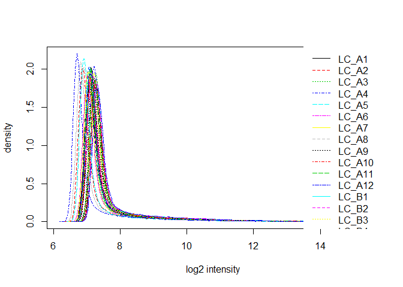
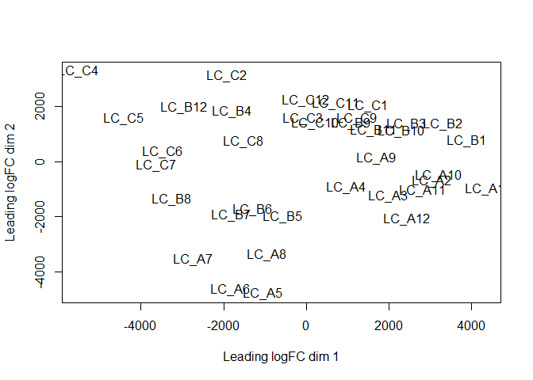

Exosome Microarray Analysis: Langerhans cells only
================
Claire Levy
January 18, 2017

Experiment overview
-------------------

Experiments were done on two cells types: Langerhans cells and vaginal epithelial cells.

Langerhans cells from 3 donors were exposed to HIV, Sendai virus or no virus and each of those were exposed to the following:

-   Exosomes
-   Seminal supernatant
-   Liposomes
-   Media control

The following analysis is only for Langerhans cells
---------------------------------------------------

    ## Inputting the data ...
    ## Perform Quality Control assessment of the LumiBatch object ...

Plots of non-normalized data

Non-specific filtering
----------------------

Limma suggests to keep probes that are expressed above background on at least n arrays where n is smallest number of replicates assigned to any of the treatment combinations.

We have 3 donors x 3 viruses x 4 Treatments so I will keep probes with detection levels above background in at least 3 samples.

Number of probes in data set before filtering:

    ##          beadNum detection exprs se.exprs
    ## Features   47323     47323 47323    47323
    ## Samples       36        36    36       36

Number of probes in data set after filtering:

    ##          beadNum detection exprs se.exprs
    ## Features   24137     24137 24137    24137
    ## Samples       36        36    36       36

### Number of DE probes for each contrast:

<table style="width:51%;">
<colgroup>
<col width="36%" />
<col width="9%" />
<col width="5%" />
</colgroup>
<thead>
<tr class="header">
<th align="center">variable</th>
<th align="center">down</th>
<th align="center">up</th>
</tr>
</thead>
<tbody>
<tr class="odd">
<td align="center">None.MediaVsNone.Exos</td>
<td align="center">0</td>
<td align="center">0</td>
</tr>
<tr class="even">
<td align="center">None.MediaVsNone.Lipo</td>
<td align="center">0</td>
<td align="center">0</td>
</tr>
<tr class="odd">
<td align="center">None.MediaVsNone.Sup</td>
<td align="center">2</td>
<td align="center">1</td>
</tr>
<tr class="even">
<td align="center">Sendai.MediaVsSendai.Exos</td>
<td align="center">0</td>
<td align="center">0</td>
</tr>
<tr class="odd">
<td align="center">Sendai.MediaVsSendai.Lipo</td>
<td align="center">0</td>
<td align="center">0</td>
</tr>
<tr class="even">
<td align="center">Sendai.MediaVsSendai.Sup</td>
<td align="center">1</td>
<td align="center">4</td>
</tr>
<tr class="odd">
<td align="center">HIV.MediaVsHIV.Exos</td>
<td align="center">0</td>
<td align="center">0</td>
</tr>
<tr class="even">
<td align="center">HIV.MediaVsHIV.Lipo</td>
<td align="center">0</td>
<td align="center">0</td>
</tr>
<tr class="odd">
<td align="center">HIV.MediaVsHIV.Sup</td>
<td align="center">9</td>
<td align="center">13</td>
</tr>
</tbody>
</table>

### None.Media Vs None.Sup DE genes

<table style="width:93%;">
<colgroup>
<col width="19%" />
<col width="15%" />
<col width="43%" />
<col width="15%" />
</colgroup>
<thead>
<tr class="header">
<th align="center"> </th>
<th align="center">TargetID</th>
<th align="center">DEFINITION</th>
<th align="center">adj.P.Val</th>
</tr>
</thead>
<tbody>
<tr class="odd">
<td align="center"><strong>4200577</strong></td>
<td align="center">GTF2IRD1</td>
<td align="center">Homo sapiens GTF2I repeat domain containing 1 (GTF2IRD1), transcript variant 1, mRNA.</td>
<td align="center">0.006405</td>
</tr>
<tr class="even">
<td align="center"><strong>2690279</strong></td>
<td align="center">ZCCHC12</td>
<td align="center">Homo sapiens zinc finger, CCHC domain containing 12 (ZCCHC12), mRNA.</td>
<td align="center">0.007722</td>
</tr>
<tr class="odd">
<td align="center"><strong>4560129</strong></td>
<td align="center">LGMN</td>
<td align="center">Homo sapiens legumain (LGMN), transcript variant 2, mRNA.</td>
<td align="center">0.02735</td>
</tr>
</tbody>
</table>

### Sendai.Media Vs Sendai.Sup DE genes

<table style="width:90%;">
<colgroup>
<col width="19%" />
<col width="15%" />
<col width="40%" />
<col width="15%" />
</colgroup>
<thead>
<tr class="header">
<th align="center"> </th>
<th align="center">TargetID</th>
<th align="center">DEFINITION</th>
<th align="center">adj.P.Val</th>
</tr>
</thead>
<tbody>
<tr class="odd">
<td align="center"><strong>1170300</strong></td>
<td align="center">MT1G</td>
<td align="center">Homo sapiens metallothionein 1G (MT1G), mRNA.</td>
<td align="center">0.006297</td>
</tr>
<tr class="even">
<td align="center"><strong>7560037</strong></td>
<td align="center">KIAA1949</td>
<td align="center">Homo sapiens KIAA1949 (KIAA1949), mRNA.</td>
<td align="center">0.006297</td>
</tr>
<tr class="odd">
<td align="center"><strong>130093</strong></td>
<td align="center">MT1H</td>
<td align="center">Homo sapiens metallothionein 1H (MT1H), mRNA.</td>
<td align="center">0.01389</td>
</tr>
<tr class="even">
<td align="center"><strong>2070288</strong></td>
<td align="center">MT1E</td>
<td align="center">Homo sapiens metallothionein 1E (MT1E), mRNA.</td>
<td align="center">0.04671</td>
</tr>
<tr class="odd">
<td align="center"><strong>6620528</strong></td>
<td align="center">MT1X</td>
<td align="center">Homo sapiens metallothionein 1X (MT1X), mRNA.</td>
<td align="center">0.04776</td>
</tr>
</tbody>
</table>

### HIV.Media Vs HIV.Sup DE genes

<table style="width:93%;">
<colgroup>
<col width="19%" />
<col width="15%" />
<col width="43%" />
<col width="15%" />
</colgroup>
<thead>
<tr class="header">
<th align="center"> </th>
<th align="center">TargetID</th>
<th align="center">DEFINITION</th>
<th align="center">adj.P.Val</th>
</tr>
</thead>
<tbody>
<tr class="odd">
<td align="center"><strong>4220187</strong></td>
<td align="center">DYSF</td>
<td align="center">Homo sapiens dysferlin, limb girdle muscular dystrophy 2B (autosomal recessive) (DYSF), mRNA.</td>
<td align="center">0.008757</td>
</tr>
<tr class="even">
<td align="center"><strong>6180706</strong></td>
<td align="center">LY6H</td>
<td align="center">Homo sapiens lymphocyte antigen 6 complex, locus H (LY6H), mRNA.</td>
<td align="center">0.008757</td>
</tr>
<tr class="odd">
<td align="center"><strong>3990561</strong></td>
<td align="center">LY6H</td>
<td align="center">Homo sapiens lymphocyte antigen 6 complex, locus H (LY6H), mRNA.</td>
<td align="center">0.008757</td>
</tr>
<tr class="even">
<td align="center"><strong>4260612</strong></td>
<td align="center">STK19</td>
<td align="center">Homo sapiens serine/threonine kinase 19 (STK19), transcript variant 1, mRNA.</td>
<td align="center">0.01302</td>
</tr>
<tr class="odd">
<td align="center"><strong>630678</strong></td>
<td align="center">ACBD7</td>
<td align="center">PREDICTED: Homo sapiens acyl-Coenzyme A binding domain containing 7 (ACBD7), mRNA.</td>
<td align="center">0.01302</td>
</tr>
<tr class="even">
<td align="center"><strong>2690279</strong></td>
<td align="center">ZCCHC12</td>
<td align="center">Homo sapiens zinc finger, CCHC domain containing 12 (ZCCHC12), mRNA.</td>
<td align="center">0.01304</td>
</tr>
<tr class="odd">
<td align="center"><strong>2030093</strong></td>
<td align="center">PKM2</td>
<td align="center">Homo sapiens pyruvate kinase, muscle (PKM2), transcript variant 2, mRNA.</td>
<td align="center">0.01995</td>
</tr>
<tr class="even">
<td align="center"><strong>4150204</strong></td>
<td align="center">PRRX2</td>
<td align="center">Homo sapiens paired related homeobox 2 (PRRX2), mRNA.</td>
<td align="center">0.03157</td>
</tr>
<tr class="odd">
<td align="center"><strong>1660484</strong></td>
<td align="center">VMO1</td>
<td align="center">Homo sapiens vitelline membrane outer layer 1 homolog (chicken) (VMO1), mRNA.</td>
<td align="center">0.03157</td>
</tr>
<tr class="even">
<td align="center"><strong>3850202</strong></td>
<td align="center">IGSF6</td>
<td align="center">Homo sapiens immunoglobulin superfamily, member 6 (IGSF6), mRNA.</td>
<td align="center">0.03157</td>
</tr>
<tr class="odd">
<td align="center"><strong>6620609</strong></td>
<td align="center">ABTB1</td>
<td align="center">Homo sapiens ankyrin repeat and BTB (POZ) domain containing 1 (ABTB1), transcript variant 3, mRNA.</td>
<td align="center">0.03157</td>
</tr>
<tr class="even">
<td align="center"><strong>2140762</strong></td>
<td align="center">YWHAE</td>
<td align="center">Homo sapiens tyrosine 3-monooxygenase/tryptophan 5-monooxygenase activation protein, epsilon polypeptide (YWHAE), mRNA.</td>
<td align="center">0.03157</td>
</tr>
<tr class="odd">
<td align="center"><strong>4230487</strong></td>
<td align="center">LOC728908</td>
<td align="center">PREDICTED: Homo sapiens misc_RNA (LOC728908), miscRNA.</td>
<td align="center">0.03157</td>
</tr>
<tr class="even">
<td align="center"><strong>2100296</strong></td>
<td align="center">NAPSA</td>
<td align="center">Homo sapiens napsin A aspartic peptidase (NAPSA), mRNA.</td>
<td align="center">0.03515</td>
</tr>
<tr class="odd">
<td align="center"><strong>160170</strong></td>
<td align="center">PKM2</td>
<td align="center">Homo sapiens pyruvate kinase, muscle (PKM2), transcript variant 3, mRNA.</td>
<td align="center">0.04301</td>
</tr>
<tr class="even">
<td align="center"><strong>6580639</strong></td>
<td align="center">ACOT7</td>
<td align="center">Homo sapiens acyl-CoA thioesterase 7 (ACOT7), transcript variant hBACHa, mRNA.</td>
<td align="center">0.04398</td>
</tr>
<tr class="odd">
<td align="center"><strong>6770097</strong></td>
<td align="center">UBTD1</td>
<td align="center">Homo sapiens ubiquitin domain containing 1 (UBTD1), mRNA.</td>
<td align="center">0.04398</td>
</tr>
<tr class="even">
<td align="center"><strong>4880551</strong></td>
<td align="center">RBM42</td>
<td align="center">Homo sapiens RNA binding motif protein 42 (RBM42), mRNA.</td>
<td align="center">0.04408</td>
</tr>
<tr class="odd">
<td align="center"><strong>2600630</strong></td>
<td align="center">CCT6A</td>
<td align="center">Homo sapiens chaperonin containing TCP1, subunit 6A (zeta 1) (CCT6A), transcript variant 1, mRNA.</td>
<td align="center">0.04408</td>
</tr>
<tr class="even">
<td align="center"><strong>70070</strong></td>
<td align="center">GRINA</td>
<td align="center">Homo sapiens glutamate receptor, ionotropic, N-methyl D-aspartate-associated protein 1 (glutamate binding) (GRINA), transcript variant 1, mRNA.</td>
<td align="center">0.04433</td>
</tr>
<tr class="odd">
<td align="center"><strong>4120538</strong></td>
<td align="center">LOC731314</td>
<td align="center">PREDICTED: Homo sapiens similar to H2A histone family, member X (LOC731314), mRNA.</td>
<td align="center">0.04433</td>
</tr>
<tr class="even">
<td align="center"><strong>4570239</strong></td>
<td align="center">LOR</td>
<td align="center">Homo sapiens loricrin (LOR), mRNA.</td>
<td align="center">0.04433</td>
</tr>
</tbody>
</table>

CAMERA testing
==============

Hallmark gene sets: top 6 results
---------------------------------

### None.Media Vs None.Exos

<table>
<colgroup>
<col width="63%" />
<col width="12%" />
<col width="16%" />
<col width="8%" />
</colgroup>
<thead>
<tr class="header">
<th align="center"> </th>
<th align="center">NGenes</th>
<th align="center">Direction</th>
<th align="center">FDR</th>
</tr>
</thead>
<tbody>
<tr class="odd">
<td align="center"><strong>HALLMARK_REACTIVE_OXIGEN_SPECIES_PATHWAY</strong></td>
<td align="center">73</td>
<td align="center">Up</td>
<td align="center">0.4394</td>
</tr>
<tr class="even">
<td align="center"><strong>HALLMARK_MTORC1_SIGNALING</strong></td>
<td align="center">294</td>
<td align="center">Down</td>
<td align="center">0.4394</td>
</tr>
<tr class="odd">
<td align="center"><strong>HALLMARK_UNFOLDED_PROTEIN_RESPONSE</strong></td>
<td align="center">154</td>
<td align="center">Down</td>
<td align="center">0.4462</td>
</tr>
<tr class="even">
<td align="center"><strong>HALLMARK_PROTEIN_SECRETION</strong></td>
<td align="center">135</td>
<td align="center">Down</td>
<td align="center">0.4462</td>
</tr>
<tr class="odd">
<td align="center"><strong>HALLMARK_DNA_REPAIR</strong></td>
<td align="center">213</td>
<td align="center">Up</td>
<td align="center">0.5954</td>
</tr>
<tr class="even">
<td align="center"><strong>HALLMARK_NOTCH_SIGNALING</strong></td>
<td align="center">39</td>
<td align="center">Down</td>
<td align="center">0.8701</td>
</tr>
</tbody>
</table>

### None.Media Vs None.Lipo

<table style="width:97%;">
<colgroup>
<col width="56%" />
<col width="12%" />
<col width="16%" />
<col width="11%" />
</colgroup>
<thead>
<tr class="header">
<th align="center"> </th>
<th align="center">NGenes</th>
<th align="center">Direction</th>
<th align="center">FDR</th>
</tr>
</thead>
<tbody>
<tr class="odd">
<td align="center"><strong>HALLMARK_TNFA_SIGNALING_VIA_NFKB</strong></td>
<td align="center">258</td>
<td align="center">Down</td>
<td align="center">2.82e-06</td>
</tr>
<tr class="even">
<td align="center"><strong>HALLMARK_OXIDATIVE_PHOSPHORYLATION</strong></td>
<td align="center">272</td>
<td align="center">Up</td>
<td align="center">0.00476</td>
</tr>
<tr class="odd">
<td align="center"><strong>HALLMARK_DNA_REPAIR</strong></td>
<td align="center">213</td>
<td align="center">Up</td>
<td align="center">0.007919</td>
</tr>
<tr class="even">
<td align="center"><strong>HALLMARK_INFLAMMATORY_RESPONSE</strong></td>
<td align="center">214</td>
<td align="center">Down</td>
<td align="center">0.01253</td>
</tr>
<tr class="odd">
<td align="center"><strong>HALLMARK_MYC_TARGETS_V2</strong></td>
<td align="center">83</td>
<td align="center">Up</td>
<td align="center">0.0172</td>
</tr>
<tr class="even">
<td align="center"><strong>HALLMARK_MYC_TARGETS_V1</strong></td>
<td align="center">306</td>
<td align="center">Up</td>
<td align="center">0.05475</td>
</tr>
</tbody>
</table>

### None.Media Vs None.Sup

<table>
<colgroup>
<col width="62%" />
<col width="12%" />
<col width="16%" />
<col width="9%" />
</colgroup>
<thead>
<tr class="header">
<th align="center"> </th>
<th align="center">NGenes</th>
<th align="center">Direction</th>
<th align="center">FDR</th>
</tr>
</thead>
<tbody>
<tr class="odd">
<td align="center"><strong>HALLMARK_UNFOLDED_PROTEIN_RESPONSE</strong></td>
<td align="center">154</td>
<td align="center">Down</td>
<td align="center">0.05744</td>
</tr>
<tr class="even">
<td align="center"><strong>HALLMARK_REACTIVE_OXIGEN_SPECIES_PATHWAY</strong></td>
<td align="center">73</td>
<td align="center">Up</td>
<td align="center">0.05744</td>
</tr>
<tr class="odd">
<td align="center"><strong>HALLMARK_PROTEIN_SECRETION</strong></td>
<td align="center">135</td>
<td align="center">Down</td>
<td align="center">0.1771</td>
</tr>
<tr class="even">
<td align="center"><strong>HALLMARK_G2M_CHECKPOINT</strong></td>
<td align="center">270</td>
<td align="center">Up</td>
<td align="center">0.2169</td>
</tr>
<tr class="odd">
<td align="center"><strong>HALLMARK_MTORC1_SIGNALING</strong></td>
<td align="center">294</td>
<td align="center">Down</td>
<td align="center">0.2454</td>
</tr>
<tr class="even">
<td align="center"><strong>HALLMARK_ALLOGRAFT_REJECTION</strong></td>
<td align="center">227</td>
<td align="center">Down</td>
<td align="center">0.2454</td>
</tr>
</tbody>
</table>

### Sendai.Media Vs Sendai.Exo

<table>
<colgroup>
<col width="63%" />
<col width="12%" />
<col width="16%" />
<col width="8%" />
</colgroup>
<thead>
<tr class="header">
<th align="center"> </th>
<th align="center">NGenes</th>
<th align="center">Direction</th>
<th align="center">FDR</th>
</tr>
</thead>
<tbody>
<tr class="odd">
<td align="center"><strong>HALLMARK_GLYCOLYSIS</strong></td>
<td align="center">242</td>
<td align="center">Up</td>
<td align="center">0.4646</td>
</tr>
<tr class="even">
<td align="center"><strong>HALLMARK_INTERFERON_ALPHA_RESPONSE</strong></td>
<td align="center">124</td>
<td align="center">Down</td>
<td align="center">0.4646</td>
</tr>
<tr class="odd">
<td align="center"><strong>HALLMARK_MYC_TARGETS_V1</strong></td>
<td align="center">306</td>
<td align="center">Down</td>
<td align="center">0.4646</td>
</tr>
<tr class="even">
<td align="center"><strong>HALLMARK_HYPOXIA</strong></td>
<td align="center">250</td>
<td align="center">Up</td>
<td align="center">0.4646</td>
</tr>
<tr class="odd">
<td align="center"><strong>HALLMARK_CHOLESTEROL_HOMEOSTASIS</strong></td>
<td align="center">94</td>
<td align="center">Up</td>
<td align="center">0.4646</td>
</tr>
<tr class="even">
<td align="center"><strong>HALLMARK_REACTIVE_OXIGEN_SPECIES_PATHWAY</strong></td>
<td align="center">73</td>
<td align="center">Up</td>
<td align="center">0.4646</td>
</tr>
</tbody>
</table>

### Sendai.Media Vs Sendai.Lipo

<table style="width:92%;">
<colgroup>
<col width="54%" />
<col width="12%" />
<col width="16%" />
<col width="8%" />
</colgroup>
<thead>
<tr class="header">
<th align="center"> </th>
<th align="center">NGenes</th>
<th align="center">Direction</th>
<th align="center">FDR</th>
</tr>
</thead>
<tbody>
<tr class="odd">
<td align="center"><strong>HALLMARK_MITOTIC_SPINDLE</strong></td>
<td align="center">251</td>
<td align="center">Up</td>
<td align="center">0.9933</td>
</tr>
<tr class="even">
<td align="center"><strong>HALLMARK_TNFA_SIGNALING_VIA_NFKB</strong></td>
<td align="center">258</td>
<td align="center">Down</td>
<td align="center">0.9933</td>
</tr>
<tr class="odd">
<td align="center"><strong>HALLMARK_SPERMATOGENESIS</strong></td>
<td align="center">117</td>
<td align="center">Up</td>
<td align="center">0.9933</td>
</tr>
<tr class="even">
<td align="center"><strong>HALLMARK_UV_RESPONSE_UP</strong></td>
<td align="center">196</td>
<td align="center">Down</td>
<td align="center">0.9933</td>
</tr>
<tr class="odd">
<td align="center"><strong>HALLMARK_PANCREAS_BETA_CELLS</strong></td>
<td align="center">30</td>
<td align="center">Down</td>
<td align="center">0.9933</td>
</tr>
<tr class="even">
<td align="center"><strong>HALLMARK_TGF_BETA_SIGNALING</strong></td>
<td align="center">74</td>
<td align="center">Down</td>
<td align="center">0.9933</td>
</tr>
</tbody>
</table>

### Sendai.Media Vs Sendai.Sup

<table style="width:99%;">
<colgroup>
<col width="56%" />
<col width="12%" />
<col width="16%" />
<col width="12%" />
</colgroup>
<thead>
<tr class="header">
<th align="center"> </th>
<th align="center">NGenes</th>
<th align="center">Direction</th>
<th align="center">FDR</th>
</tr>
</thead>
<tbody>
<tr class="odd">
<td align="center"><strong>HALLMARK_INTERFERON_ALPHA_RESPONSE</strong></td>
<td align="center">124</td>
<td align="center">Down</td>
<td align="center">2.021e-09</td>
</tr>
<tr class="even">
<td align="center"><strong>HALLMARK_INTERFERON_GAMMA_RESPONSE</strong></td>
<td align="center">270</td>
<td align="center">Down</td>
<td align="center">1.517e-06</td>
</tr>
<tr class="odd">
<td align="center"><strong>HALLMARK_IL6_JAK_STAT3_SIGNALING</strong></td>
<td align="center">104</td>
<td align="center">Down</td>
<td align="center">0.008284</td>
</tr>
<tr class="even">
<td align="center"><strong>HALLMARK_INFLAMMATORY_RESPONSE</strong></td>
<td align="center">214</td>
<td align="center">Down</td>
<td align="center">0.01249</td>
</tr>
<tr class="odd">
<td align="center"><strong>HALLMARK_TNFA_SIGNALING_VIA_NFKB</strong></td>
<td align="center">258</td>
<td align="center">Down</td>
<td align="center">0.01249</td>
</tr>
<tr class="even">
<td align="center"><strong>HALLMARK_ALLOGRAFT_REJECTION</strong></td>
<td align="center">227</td>
<td align="center">Down</td>
<td align="center">0.05019</td>
</tr>
</tbody>
</table>

### HIV.Media Vs HIV.Exo

<table style="width:94%;">
<colgroup>
<col width="54%" />
<col width="12%" />
<col width="16%" />
<col width="11%" />
</colgroup>
<thead>
<tr class="header">
<th align="center"> </th>
<th align="center">NGenes</th>
<th align="center">Direction</th>
<th align="center">FDR</th>
</tr>
</thead>
<tbody>
<tr class="odd">
<td align="center"><strong>HALLMARK_PROTEIN_SECRETION</strong></td>
<td align="center">135</td>
<td align="center">Down</td>
<td align="center">0.002046</td>
</tr>
<tr class="even">
<td align="center"><strong>HALLMARK_TNFA_SIGNALING_VIA_NFKB</strong></td>
<td align="center">258</td>
<td align="center">Down</td>
<td align="center">0.03867</td>
</tr>
<tr class="odd">
<td align="center"><strong>HALLMARK_INFLAMMATORY_RESPONSE</strong></td>
<td align="center">214</td>
<td align="center">Down</td>
<td align="center">0.04704</td>
</tr>
<tr class="even">
<td align="center"><strong>HALLMARK_MTORC1_SIGNALING</strong></td>
<td align="center">294</td>
<td align="center">Down</td>
<td align="center">0.04704</td>
</tr>
<tr class="odd">
<td align="center"><strong>HALLMARK_IL6_JAK_STAT3_SIGNALING</strong></td>
<td align="center">104</td>
<td align="center">Down</td>
<td align="center">0.06261</td>
</tr>
<tr class="even">
<td align="center"><strong>HALLMARK_ALLOGRAFT_REJECTION</strong></td>
<td align="center">227</td>
<td align="center">Down</td>
<td align="center">0.06583</td>
</tr>
</tbody>
</table>

### HIV.Media Vs HIV.Lipo

<table style="width:93%;">
<colgroup>
<col width="54%" />
<col width="12%" />
<col width="16%" />
<col width="9%" />
</colgroup>
<thead>
<tr class="header">
<th align="center"> </th>
<th align="center">NGenes</th>
<th align="center">Direction</th>
<th align="center">FDR</th>
</tr>
</thead>
<tbody>
<tr class="odd">
<td align="center"><strong>HALLMARK_TNFA_SIGNALING_VIA_NFKB</strong></td>
<td align="center">258</td>
<td align="center">Down</td>
<td align="center">0.01121</td>
</tr>
<tr class="even">
<td align="center"><strong>HALLMARK_MYC_TARGETS_V2</strong></td>
<td align="center">83</td>
<td align="center">Up</td>
<td align="center">0.05469</td>
</tr>
<tr class="odd">
<td align="center"><strong>HALLMARK_ANDROGEN_RESPONSE</strong></td>
<td align="center">126</td>
<td align="center">Down</td>
<td align="center">0.3641</td>
</tr>
<tr class="even">
<td align="center"><strong>HALLMARK_COMPLEMENT</strong></td>
<td align="center">226</td>
<td align="center">Down</td>
<td align="center">0.3641</td>
</tr>
<tr class="odd">
<td align="center"><strong>HALLMARK_IL2_STAT5_SIGNALING</strong></td>
<td align="center">249</td>
<td align="center">Down</td>
<td align="center">0.3641</td>
</tr>
<tr class="even">
<td align="center"><strong>HALLMARK_PROTEIN_SECRETION</strong></td>
<td align="center">135</td>
<td align="center">Down</td>
<td align="center">0.3641</td>
</tr>
</tbody>
</table>

### HIV.Media Vs HIV.Sup

<table>
<colgroup>
<col width="61%" />
<col width="11%" />
<col width="15%" />
<col width="10%" />
</colgroup>
<thead>
<tr class="header">
<th align="center"> </th>
<th align="center">NGenes</th>
<th align="center">Direction</th>
<th align="center">FDR</th>
</tr>
</thead>
<tbody>
<tr class="odd">
<td align="center"><strong>HALLMARK_PROTEIN_SECRETION</strong></td>
<td align="center">135</td>
<td align="center">Down</td>
<td align="center">0.003879</td>
</tr>
<tr class="even">
<td align="center"><strong>HALLMARK_INFLAMMATORY_RESPONSE</strong></td>
<td align="center">214</td>
<td align="center">Down</td>
<td align="center">0.09144</td>
</tr>
<tr class="odd">
<td align="center"><strong>HALLMARK_ALLOGRAFT_REJECTION</strong></td>
<td align="center">227</td>
<td align="center">Down</td>
<td align="center">0.09144</td>
</tr>
<tr class="even">
<td align="center"><strong>HALLMARK_REACTIVE_OXIGEN_SPECIES_PATHWAY</strong></td>
<td align="center">73</td>
<td align="center">Up</td>
<td align="center">0.1059</td>
</tr>
<tr class="odd">
<td align="center"><strong>HALLMARK_MYC_TARGETS_V2</strong></td>
<td align="center">83</td>
<td align="center">Down</td>
<td align="center">0.2418</td>
</tr>
<tr class="even">
<td align="center"><strong>HALLMARK_E2F_TARGETS</strong></td>
<td align="center">287</td>
<td align="center">Up</td>
<td align="center">0.2418</td>
</tr>
</tbody>
</table>

GO biological process gene sets: top 6 results
----------------------------------------------

Sean wrote some code (<https://github.com/seaaan/Bioinformatics/tree/master/GOTermMappingsForCamera>) to extract just the Biological Process gene sets out of all the GO gene sets. I will use those to test against the LC data here.

### None.Media Vs None.Exos

<table>
<colgroup>
<col width="64%" />
<col width="11%" />
<col width="15%" />
<col width="7%" />
</colgroup>
<thead>
<tr class="header">
<th align="center"> </th>
<th align="center">NGenes</th>
<th align="center">Direction</th>
<th align="center">FDR</th>
</tr>
</thead>
<tbody>
<tr class="odd">
<td align="center"><strong>GO_REGULATION_OF_APPETITE</strong></td>
<td align="center">17</td>
<td align="center">Up</td>
<td align="center">0.2187</td>
</tr>
<tr class="even">
<td align="center"><strong>GO_OXYGEN_TRANSPORT</strong></td>
<td align="center">12</td>
<td align="center">Up</td>
<td align="center">0.3195</td>
</tr>
<tr class="odd">
<td align="center"><strong>GO_CELLULAR_RESPONSE_TO_CADMIUM_ION</strong></td>
<td align="center">12</td>
<td align="center">Up</td>
<td align="center">0.3195</td>
</tr>
<tr class="even">
<td align="center"><strong>GO_NEGATIVE_REGULATION_OF_RESPONSE_TO_FOOD</strong></td>
<td align="center">12</td>
<td align="center">Up</td>
<td align="center">0.3195</td>
</tr>
<tr class="odd">
<td align="center"><strong>GO_NEGATIVE_REGULATION_OF_APPETITE</strong></td>
<td align="center">12</td>
<td align="center">Up</td>
<td align="center">0.3195</td>
</tr>
<tr class="even">
<td align="center"><strong>GO_RELAXATION_OF_CARDIAC_MUSCLE</strong></td>
<td align="center">16</td>
<td align="center">Down</td>
<td align="center">0.3195</td>
</tr>
</tbody>
</table>

### None.Media Vs None.Lipo

<table style="width:97%;">
<caption>Table continues below</caption>
<colgroup>
<col width="86%" />
<col width="11%" />
</colgroup>
<thead>
<tr class="header">
<th align="center"> </th>
<th align="center">NGenes</th>
</tr>
</thead>
<tbody>
<tr class="odd">
<td align="center"><strong>GO_MITOCHONDRIAL_RESPIRATORY_CHAIN_COMPLEX_I_BIOGENESIS</strong></td>
<td align="center">68</td>
</tr>
<tr class="even">
<td align="center"><strong>GO_MITOCHONDRIAL_RESPIRATORY_CHAIN_COMPLEX_I_ASSEMBLY</strong></td>
<td align="center">68</td>
</tr>
<tr class="odd">
<td align="center"><strong>GO_NADH_DEHYDROGENASE_COMPLEX_ASSEMBLY</strong></td>
<td align="center">68</td>
</tr>
<tr class="even">
<td align="center"><strong>GO_MITOCHONDRIAL_RESPIRATORY_CHAIN_COMPLEX_ASSEMBLY</strong></td>
<td align="center">95</td>
</tr>
<tr class="odd">
<td align="center"><strong>GO_MITOCHONDRIAL_TRANSLATION</strong></td>
<td align="center">142</td>
</tr>
<tr class="even">
<td align="center"><strong>GO_MITOCHONDRIAL_ELECTRON_TRANSPORT_NADH_TO_UBIQUINONE</strong></td>
<td align="center">41</td>
</tr>
</tbody>
</table>

<table>
<caption>Table continues below</caption>
<colgroup>
<col width="84%" />
<col width="15%" />
</colgroup>
<thead>
<tr class="header">
<th align="center"> </th>
<th align="center">Direction</th>
</tr>
</thead>
<tbody>
<tr class="odd">
<td align="center"><strong>GO_MITOCHONDRIAL_RESPIRATORY_CHAIN_COMPLEX_I_BIOGENESIS</strong></td>
<td align="center">Up</td>
</tr>
<tr class="even">
<td align="center"><strong>GO_MITOCHONDRIAL_RESPIRATORY_CHAIN_COMPLEX_I_ASSEMBLY</strong></td>
<td align="center">Up</td>
</tr>
<tr class="odd">
<td align="center"><strong>GO_NADH_DEHYDROGENASE_COMPLEX_ASSEMBLY</strong></td>
<td align="center">Up</td>
</tr>
<tr class="even">
<td align="center"><strong>GO_MITOCHONDRIAL_RESPIRATORY_CHAIN_COMPLEX_ASSEMBLY</strong></td>
<td align="center">Up</td>
</tr>
<tr class="odd">
<td align="center"><strong>GO_MITOCHONDRIAL_TRANSLATION</strong></td>
<td align="center">Up</td>
</tr>
<tr class="even">
<td align="center"><strong>GO_MITOCHONDRIAL_ELECTRON_TRANSPORT_NADH_TO_UBIQUINONE</strong></td>
<td align="center">Up</td>
</tr>
</tbody>
</table>

<table style="width:99%;">
<colgroup>
<col width="86%" />
<col width="12%" />
</colgroup>
<thead>
<tr class="header">
<th align="center"> </th>
<th align="center">FDR</th>
</tr>
</thead>
<tbody>
<tr class="odd">
<td align="center"><strong>GO_MITOCHONDRIAL_RESPIRATORY_CHAIN_COMPLEX_I_BIOGENESIS</strong></td>
<td align="center">0.0005241</td>
</tr>
<tr class="even">
<td align="center"><strong>GO_MITOCHONDRIAL_RESPIRATORY_CHAIN_COMPLEX_I_ASSEMBLY</strong></td>
<td align="center">0.0005241</td>
</tr>
<tr class="odd">
<td align="center"><strong>GO_NADH_DEHYDROGENASE_COMPLEX_ASSEMBLY</strong></td>
<td align="center">0.0005241</td>
</tr>
<tr class="even">
<td align="center"><strong>GO_MITOCHONDRIAL_RESPIRATORY_CHAIN_COMPLEX_ASSEMBLY</strong></td>
<td align="center">0.0005595</td>
</tr>
<tr class="odd">
<td align="center"><strong>GO_MITOCHONDRIAL_TRANSLATION</strong></td>
<td align="center">0.000919</td>
</tr>
<tr class="even">
<td align="center"><strong>GO_MITOCHONDRIAL_ELECTRON_TRANSPORT_NADH_TO_UBIQUINONE</strong></td>
<td align="center">0.001378</td>
</tr>
</tbody>
</table>

### None.Media Vs None.Sup

<table>
<caption>Table continues below</caption>
<colgroup>
<col width="89%" />
<col width="10%" />
</colgroup>
<thead>
<tr class="header">
<th align="center"> </th>
<th align="center">NGenes</th>
</tr>
</thead>
<tbody>
<tr class="odd">
<td align="center"><strong>GO_CELLULAR_RESPONSE_TO_CADMIUM_ION</strong></td>
<td align="center">12</td>
</tr>
<tr class="even">
<td align="center"><strong>GO_CELLULAR_RESPONSE_TO_ZINC_ION</strong></td>
<td align="center">17</td>
</tr>
<tr class="odd">
<td align="center"><strong>GO_POSITIVE_REGULATION_OF_MYELOID_LEUKOCYTE_MEDIATED_IMMUNITY</strong></td>
<td align="center">18</td>
</tr>
<tr class="even">
<td align="center"><strong>GO_RESPONSE_TO_CADMIUM_ION</strong></td>
<td align="center">49</td>
</tr>
<tr class="odd">
<td align="center"><strong>GO_GAS_TRANSPORT</strong></td>
<td align="center">16</td>
</tr>
<tr class="even">
<td align="center"><strong>GO_POSITIVE_REGULATION_OF_MAST_CELL_DEGRANULATION</strong></td>
<td align="center">14</td>
</tr>
</tbody>
</table>

<table>
<caption>Table continues below</caption>
<colgroup>
<col width="86%" />
<col width="13%" />
</colgroup>
<thead>
<tr class="header">
<th align="center"> </th>
<th align="center">Direction</th>
</tr>
</thead>
<tbody>
<tr class="odd">
<td align="center"><strong>GO_CELLULAR_RESPONSE_TO_CADMIUM_ION</strong></td>
<td align="center">Up</td>
</tr>
<tr class="even">
<td align="center"><strong>GO_CELLULAR_RESPONSE_TO_ZINC_ION</strong></td>
<td align="center">Up</td>
</tr>
<tr class="odd">
<td align="center"><strong>GO_POSITIVE_REGULATION_OF_MYELOID_LEUKOCYTE_MEDIATED_IMMUNITY</strong></td>
<td align="center">Down</td>
</tr>
<tr class="even">
<td align="center"><strong>GO_RESPONSE_TO_CADMIUM_ION</strong></td>
<td align="center">Up</td>
</tr>
<tr class="odd">
<td align="center"><strong>GO_GAS_TRANSPORT</strong></td>
<td align="center">Up</td>
</tr>
<tr class="even">
<td align="center"><strong>GO_POSITIVE_REGULATION_OF_MAST_CELL_DEGRANULATION</strong></td>
<td align="center">Down</td>
</tr>
</tbody>
</table>

<table>
<colgroup>
<col width="89%" />
<col width="10%" />
</colgroup>
<thead>
<tr class="header">
<th align="center"> </th>
<th align="center">FDR</th>
</tr>
</thead>
<tbody>
<tr class="odd">
<td align="center"><strong>GO_CELLULAR_RESPONSE_TO_CADMIUM_ION</strong></td>
<td align="center">1.06e-09</td>
</tr>
<tr class="even">
<td align="center"><strong>GO_CELLULAR_RESPONSE_TO_ZINC_ION</strong></td>
<td align="center">0.01027</td>
</tr>
<tr class="odd">
<td align="center"><strong>GO_POSITIVE_REGULATION_OF_MYELOID_LEUKOCYTE_MEDIATED_IMMUNITY</strong></td>
<td align="center">0.0375</td>
</tr>
<tr class="even">
<td align="center"><strong>GO_RESPONSE_TO_CADMIUM_ION</strong></td>
<td align="center">0.03927</td>
</tr>
<tr class="odd">
<td align="center"><strong>GO_GAS_TRANSPORT</strong></td>
<td align="center">0.03927</td>
</tr>
<tr class="even">
<td align="center"><strong>GO_POSITIVE_REGULATION_OF_MAST_CELL_DEGRANULATION</strong></td>
<td align="center">0.03927</td>
</tr>
</tbody>
</table>

### Sendai.Media Vs Sendai.Exo

<table>
<caption>Table continues below</caption>
<colgroup>
<col width="90%" />
<col width="9%" />
</colgroup>
<thead>
<tr class="header">
<th align="center"> </th>
<th align="center">NGenes</th>
</tr>
</thead>
<tbody>
<tr class="odd">
<td align="center"><strong>GO_HEMATOPOIETIC_STEM_CELL_PROLIFERATION</strong></td>
<td align="center">10</td>
</tr>
<tr class="even">
<td align="center"><strong>GO_NUCLEAR_TRANSCRIBED_MRNA_CATABOLIC_PROCESS_NONSENSE_MEDIATED_DECAY</strong></td>
<td align="center">180</td>
</tr>
<tr class="odd">
<td align="center"><strong>GO_HEXOSE_CATABOLIC_PROCESS</strong></td>
<td align="center">58</td>
</tr>
<tr class="even">
<td align="center"><strong>GO_GLUCOSE_CATABOLIC_PROCESS</strong></td>
<td align="center">40</td>
</tr>
<tr class="odd">
<td align="center"><strong>GO_PYRUVATE_METABOLIC_PROCESS</strong></td>
<td align="center">76</td>
</tr>
<tr class="even">
<td align="center"><strong>GO_ATP_GENERATION_FROM_ADP</strong></td>
<td align="center">51</td>
</tr>
</tbody>
</table>

<table>
<caption>Table continues below</caption>
<colgroup>
<col width="87%" />
<col width="12%" />
</colgroup>
<thead>
<tr class="header">
<th align="center"> </th>
<th align="center">Direction</th>
</tr>
</thead>
<tbody>
<tr class="odd">
<td align="center"><strong>GO_HEMATOPOIETIC_STEM_CELL_PROLIFERATION</strong></td>
<td align="center">Up</td>
</tr>
<tr class="even">
<td align="center"><strong>GO_NUCLEAR_TRANSCRIBED_MRNA_CATABOLIC_PROCESS_NONSENSE_MEDIATED_DECAY</strong></td>
<td align="center">Down</td>
</tr>
<tr class="odd">
<td align="center"><strong>GO_HEXOSE_CATABOLIC_PROCESS</strong></td>
<td align="center">Up</td>
</tr>
<tr class="even">
<td align="center"><strong>GO_GLUCOSE_CATABOLIC_PROCESS</strong></td>
<td align="center">Up</td>
</tr>
<tr class="odd">
<td align="center"><strong>GO_PYRUVATE_METABOLIC_PROCESS</strong></td>
<td align="center">Up</td>
</tr>
<tr class="even">
<td align="center"><strong>GO_ATP_GENERATION_FROM_ADP</strong></td>
<td align="center">Up</td>
</tr>
</tbody>
</table>

<table>
<colgroup>
<col width="91%" />
<col width="8%" />
</colgroup>
<thead>
<tr class="header">
<th align="center"> </th>
<th align="center">FDR</th>
</tr>
</thead>
<tbody>
<tr class="odd">
<td align="center"><strong>GO_HEMATOPOIETIC_STEM_CELL_PROLIFERATION</strong></td>
<td align="center">0.08157</td>
</tr>
<tr class="even">
<td align="center"><strong>GO_NUCLEAR_TRANSCRIBED_MRNA_CATABOLIC_PROCESS_NONSENSE_MEDIATED_DECAY</strong></td>
<td align="center">0.08157</td>
</tr>
<tr class="odd">
<td align="center"><strong>GO_HEXOSE_CATABOLIC_PROCESS</strong></td>
<td align="center">0.08157</td>
</tr>
<tr class="even">
<td align="center"><strong>GO_GLUCOSE_CATABOLIC_PROCESS</strong></td>
<td align="center">0.08157</td>
</tr>
<tr class="odd">
<td align="center"><strong>GO_PYRUVATE_METABOLIC_PROCESS</strong></td>
<td align="center">0.09873</td>
</tr>
<tr class="even">
<td align="center"><strong>GO_ATP_GENERATION_FROM_ADP</strong></td>
<td align="center">0.1045</td>
</tr>
</tbody>
</table>

### Sendai.Media Vs Sendai.Lipo

<table>
<caption>Table continues below</caption>
<colgroup>
<col width="90%" />
<col width="9%" />
</colgroup>
<thead>
<tr class="header">
<th align="center"> </th>
<th align="center">NGenes</th>
</tr>
</thead>
<tbody>
<tr class="odd">
<td align="center"><strong>GO_NUCLEAR_TRANSCRIBED_MRNA_CATABOLIC_PROCESS_NONSENSE_MEDIATED_DECAY</strong></td>
<td align="center">180</td>
</tr>
<tr class="even">
<td align="center"><strong>GO_REGULATION_OF_ANION_TRANSMEMBRANE_TRANSPORT</strong></td>
<td align="center">31</td>
</tr>
<tr class="odd">
<td align="center"><strong>GO_PROTEIN_EXPORT_FROM_NUCLEUS</strong></td>
<td align="center">36</td>
</tr>
<tr class="even">
<td align="center"><strong>GO_DISRUPTION_OF_CELLS_OF_OTHER_ORGANISM</strong></td>
<td align="center">14</td>
</tr>
<tr class="odd">
<td align="center"><strong>GO_KILLING_OF_CELLS_OF_OTHER_ORGANISM</strong></td>
<td align="center">14</td>
</tr>
<tr class="even">
<td align="center"><strong>GO_PROTEIN_LOCALIZATION_TO_LYSOSOME</strong></td>
<td align="center">32</td>
</tr>
</tbody>
</table>

<table>
<caption>Table continues below</caption>
<colgroup>
<col width="87%" />
<col width="12%" />
</colgroup>
<thead>
<tr class="header">
<th align="center"> </th>
<th align="center">Direction</th>
</tr>
</thead>
<tbody>
<tr class="odd">
<td align="center"><strong>GO_NUCLEAR_TRANSCRIBED_MRNA_CATABOLIC_PROCESS_NONSENSE_MEDIATED_DECAY</strong></td>
<td align="center">Down</td>
</tr>
<tr class="even">
<td align="center"><strong>GO_REGULATION_OF_ANION_TRANSMEMBRANE_TRANSPORT</strong></td>
<td align="center">Up</td>
</tr>
<tr class="odd">
<td align="center"><strong>GO_PROTEIN_EXPORT_FROM_NUCLEUS</strong></td>
<td align="center">Up</td>
</tr>
<tr class="even">
<td align="center"><strong>GO_DISRUPTION_OF_CELLS_OF_OTHER_ORGANISM</strong></td>
<td align="center">Down</td>
</tr>
<tr class="odd">
<td align="center"><strong>GO_KILLING_OF_CELLS_OF_OTHER_ORGANISM</strong></td>
<td align="center">Down</td>
</tr>
<tr class="even">
<td align="center"><strong>GO_PROTEIN_LOCALIZATION_TO_LYSOSOME</strong></td>
<td align="center">Up</td>
</tr>
</tbody>
</table>

<table>
<colgroup>
<col width="92%" />
<col width="7%" />
</colgroup>
<thead>
<tr class="header">
<th align="center"> </th>
<th align="center">FDR</th>
</tr>
</thead>
<tbody>
<tr class="odd">
<td align="center"><strong>GO_NUCLEAR_TRANSCRIBED_MRNA_CATABOLIC_PROCESS_NONSENSE_MEDIATED_DECAY</strong></td>
<td align="center">0.9987</td>
</tr>
<tr class="even">
<td align="center"><strong>GO_REGULATION_OF_ANION_TRANSMEMBRANE_TRANSPORT</strong></td>
<td align="center">0.9987</td>
</tr>
<tr class="odd">
<td align="center"><strong>GO_PROTEIN_EXPORT_FROM_NUCLEUS</strong></td>
<td align="center">0.9987</td>
</tr>
<tr class="even">
<td align="center"><strong>GO_DISRUPTION_OF_CELLS_OF_OTHER_ORGANISM</strong></td>
<td align="center">0.9987</td>
</tr>
<tr class="odd">
<td align="center"><strong>GO_KILLING_OF_CELLS_OF_OTHER_ORGANISM</strong></td>
<td align="center">0.9987</td>
</tr>
<tr class="even">
<td align="center"><strong>GO_PROTEIN_LOCALIZATION_TO_LYSOSOME</strong></td>
<td align="center">0.9987</td>
</tr>
</tbody>
</table>

### Sendai.Media Vs Sendai.Sup

<table style="width:96%;">
<caption>Table continues below</caption>
<colgroup>
<col width="84%" />
<col width="11%" />
</colgroup>
<thead>
<tr class="header">
<th align="center"> </th>
<th align="center">NGenes</th>
</tr>
</thead>
<tbody>
<tr class="odd">
<td align="center"><strong>GO_CELLULAR_RESPONSE_TO_CADMIUM_ION</strong></td>
<td align="center">12</td>
</tr>
<tr class="even">
<td align="center"><strong>GO_CELLULAR_RESPONSE_TO_ZINC_ION</strong></td>
<td align="center">17</td>
</tr>
<tr class="odd">
<td align="center"><strong>GO_NIK_NF_KAPPAB_SIGNALING</strong></td>
<td align="center">120</td>
</tr>
<tr class="even">
<td align="center"><strong>GO_RESPONSE_TO_TYPE_I_INTERFERON</strong></td>
<td align="center">86</td>
</tr>
<tr class="odd">
<td align="center"><strong>GO_TUMOR_NECROSIS_FACTOR_MEDIATED_SIGNALING_PATHWAY</strong></td>
<td align="center">160</td>
</tr>
<tr class="even">
<td align="center"><strong>GO_REGULATION_OF_CELLULAR_AMINO_ACID_METABOLIC_PROCESS</strong></td>
<td align="center">83</td>
</tr>
</tbody>
</table>

<table>
<caption>Table continues below</caption>
<colgroup>
<col width="84%" />
<col width="15%" />
</colgroup>
<thead>
<tr class="header">
<th align="center"> </th>
<th align="center">Direction</th>
</tr>
</thead>
<tbody>
<tr class="odd">
<td align="center"><strong>GO_CELLULAR_RESPONSE_TO_CADMIUM_ION</strong></td>
<td align="center">Up</td>
</tr>
<tr class="even">
<td align="center"><strong>GO_CELLULAR_RESPONSE_TO_ZINC_ION</strong></td>
<td align="center">Up</td>
</tr>
<tr class="odd">
<td align="center"><strong>GO_NIK_NF_KAPPAB_SIGNALING</strong></td>
<td align="center">Down</td>
</tr>
<tr class="even">
<td align="center"><strong>GO_RESPONSE_TO_TYPE_I_INTERFERON</strong></td>
<td align="center">Down</td>
</tr>
<tr class="odd">
<td align="center"><strong>GO_TUMOR_NECROSIS_FACTOR_MEDIATED_SIGNALING_PATHWAY</strong></td>
<td align="center">Down</td>
</tr>
<tr class="even">
<td align="center"><strong>GO_REGULATION_OF_CELLULAR_AMINO_ACID_METABOLIC_PROCESS</strong></td>
<td align="center">Down</td>
</tr>
</tbody>
</table>

<table style="width:97%;">
<colgroup>
<col width="84%" />
<col width="12%" />
</colgroup>
<thead>
<tr class="header">
<th align="center"> </th>
<th align="center">FDR</th>
</tr>
</thead>
<tbody>
<tr class="odd">
<td align="center"><strong>GO_CELLULAR_RESPONSE_TO_CADMIUM_ION</strong></td>
<td align="center">6.198e-07</td>
</tr>
<tr class="even">
<td align="center"><strong>GO_CELLULAR_RESPONSE_TO_ZINC_ION</strong></td>
<td align="center">1.885e-06</td>
</tr>
<tr class="odd">
<td align="center"><strong>GO_NIK_NF_KAPPAB_SIGNALING</strong></td>
<td align="center">0.001197</td>
</tr>
<tr class="even">
<td align="center"><strong>GO_RESPONSE_TO_TYPE_I_INTERFERON</strong></td>
<td align="center">0.002643</td>
</tr>
<tr class="odd">
<td align="center"><strong>GO_TUMOR_NECROSIS_FACTOR_MEDIATED_SIGNALING_PATHWAY</strong></td>
<td align="center">0.004295</td>
</tr>
<tr class="even">
<td align="center"><strong>GO_REGULATION_OF_CELLULAR_AMINO_ACID_METABOLIC_PROCESS</strong></td>
<td align="center">0.004295</td>
</tr>
</tbody>
</table>

### HIV.Media Vs HIV.Exo

<table>
<caption>Table continues below</caption>
<colgroup>
<col width="89%" />
<col width="10%" />
</colgroup>
<thead>
<tr class="header">
<th align="center"> </th>
<th align="center">NGenes</th>
</tr>
</thead>
<tbody>
<tr class="odd">
<td align="center"><strong>GO_PROTEIN_EXIT_FROM_ENDOPLASMIC_RETICULUM</strong></td>
<td align="center">25</td>
</tr>
<tr class="even">
<td align="center"><strong>GO_RETROGRADE_PROTEIN_TRANSPORT_ER_TO_CYTOSOL</strong></td>
<td align="center">21</td>
</tr>
<tr class="odd">
<td align="center"><strong>GO_RESPONSE_TO_MURAMYL_DIPEPTIDE</strong></td>
<td align="center">21</td>
</tr>
<tr class="even">
<td align="center"><strong>GO_ERAD_PATHWAY</strong></td>
<td align="center">99</td>
</tr>
<tr class="odd">
<td align="center"><strong>GO_REGULATION_OF_INTERLEUKIN_6_PRODUCTION</strong></td>
<td align="center">108</td>
</tr>
<tr class="even">
<td align="center"><strong>GO_ER_ASSOCIATED_UBIQUITIN_DEPENDENT_PROTEIN_CATABOLIC_PROCESS</strong></td>
<td align="center">79</td>
</tr>
</tbody>
</table>

<table>
<caption>Table continues below</caption>
<colgroup>
<col width="86%" />
<col width="13%" />
</colgroup>
<thead>
<tr class="header">
<th align="center"> </th>
<th align="center">Direction</th>
</tr>
</thead>
<tbody>
<tr class="odd">
<td align="center"><strong>GO_PROTEIN_EXIT_FROM_ENDOPLASMIC_RETICULUM</strong></td>
<td align="center">Down</td>
</tr>
<tr class="even">
<td align="center"><strong>GO_RETROGRADE_PROTEIN_TRANSPORT_ER_TO_CYTOSOL</strong></td>
<td align="center">Down</td>
</tr>
<tr class="odd">
<td align="center"><strong>GO_RESPONSE_TO_MURAMYL_DIPEPTIDE</strong></td>
<td align="center">Down</td>
</tr>
<tr class="even">
<td align="center"><strong>GO_ERAD_PATHWAY</strong></td>
<td align="center">Down</td>
</tr>
<tr class="odd">
<td align="center"><strong>GO_REGULATION_OF_INTERLEUKIN_6_PRODUCTION</strong></td>
<td align="center">Down</td>
</tr>
<tr class="even">
<td align="center"><strong>GO_ER_ASSOCIATED_UBIQUITIN_DEPENDENT_PROTEIN_CATABOLIC_PROCESS</strong></td>
<td align="center">Down</td>
</tr>
</tbody>
</table>

<table>
<colgroup>
<col width="90%" />
<col width="9%" />
</colgroup>
<thead>
<tr class="header">
<th align="center"> </th>
<th align="center">FDR</th>
</tr>
</thead>
<tbody>
<tr class="odd">
<td align="center"><strong>GO_PROTEIN_EXIT_FROM_ENDOPLASMIC_RETICULUM</strong></td>
<td align="center">0.01004</td>
</tr>
<tr class="even">
<td align="center"><strong>GO_RETROGRADE_PROTEIN_TRANSPORT_ER_TO_CYTOSOL</strong></td>
<td align="center">0.01004</td>
</tr>
<tr class="odd">
<td align="center"><strong>GO_RESPONSE_TO_MURAMYL_DIPEPTIDE</strong></td>
<td align="center">0.0293</td>
</tr>
<tr class="even">
<td align="center"><strong>GO_ERAD_PATHWAY</strong></td>
<td align="center">0.0293</td>
</tr>
<tr class="odd">
<td align="center"><strong>GO_REGULATION_OF_INTERLEUKIN_6_PRODUCTION</strong></td>
<td align="center">0.0293</td>
</tr>
<tr class="even">
<td align="center"><strong>GO_ER_ASSOCIATED_UBIQUITIN_DEPENDENT_PROTEIN_CATABOLIC_PROCESS</strong></td>
<td align="center">0.0293</td>
</tr>
</tbody>
</table>

### HIV.Media Vs HIV.Lipo

<table style="width:97%;">
<caption>Table continues below</caption>
<colgroup>
<col width="86%" />
<col width="11%" />
</colgroup>
<thead>
<tr class="header">
<th align="center"> </th>
<th align="center">NGenes</th>
</tr>
</thead>
<tbody>
<tr class="odd">
<td align="center"><strong>GO_MITOCHONDRIAL_RESPIRATORY_CHAIN_COMPLEX_I_BIOGENESIS</strong></td>
<td align="center">68</td>
</tr>
<tr class="even">
<td align="center"><strong>GO_MITOCHONDRIAL_RESPIRATORY_CHAIN_COMPLEX_I_ASSEMBLY</strong></td>
<td align="center">68</td>
</tr>
<tr class="odd">
<td align="center"><strong>GO_NADH_DEHYDROGENASE_COMPLEX_ASSEMBLY</strong></td>
<td align="center">68</td>
</tr>
<tr class="even">
<td align="center"><strong>GO_MITOCHONDRIAL_RESPIRATORY_CHAIN_COMPLEX_ASSEMBLY</strong></td>
<td align="center">95</td>
</tr>
<tr class="odd">
<td align="center"><strong>GO_RRNA_MODIFICATION</strong></td>
<td align="center">36</td>
</tr>
<tr class="even">
<td align="center"><strong>GO_RRNA_METHYLATION</strong></td>
<td align="center">18</td>
</tr>
</tbody>
</table>

<table>
<colgroup>
<col width="77%" />
<col width="15%" />
<col width="7%" />
</colgroup>
<thead>
<tr class="header">
<th align="center"> </th>
<th align="center">Direction</th>
<th align="center">FDR</th>
</tr>
</thead>
<tbody>
<tr class="odd">
<td align="center"><strong>GO_MITOCHONDRIAL_RESPIRATORY_CHAIN_COMPLEX_I_BIOGENESIS</strong></td>
<td align="center">Up</td>
<td align="center">0.0135</td>
</tr>
<tr class="even">
<td align="center"><strong>GO_MITOCHONDRIAL_RESPIRATORY_CHAIN_COMPLEX_I_ASSEMBLY</strong></td>
<td align="center">Up</td>
<td align="center">0.0135</td>
</tr>
<tr class="odd">
<td align="center"><strong>GO_NADH_DEHYDROGENASE_COMPLEX_ASSEMBLY</strong></td>
<td align="center">Up</td>
<td align="center">0.0135</td>
</tr>
<tr class="even">
<td align="center"><strong>GO_MITOCHONDRIAL_RESPIRATORY_CHAIN_COMPLEX_ASSEMBLY</strong></td>
<td align="center">Up</td>
<td align="center">0.2256</td>
</tr>
<tr class="odd">
<td align="center"><strong>GO_RRNA_MODIFICATION</strong></td>
<td align="center">Up</td>
<td align="center">0.227</td>
</tr>
<tr class="even">
<td align="center"><strong>GO_RRNA_METHYLATION</strong></td>
<td align="center">Up</td>
<td align="center">0.5179</td>
</tr>
</tbody>
</table>

### HIV.Media Vs HIV.Sup

<table style="width:97%;">
<caption>Table continues below</caption>
<colgroup>
<col width="86%" />
<col width="11%" />
</colgroup>
<thead>
<tr class="header">
<th align="center"> </th>
<th align="center">NGenes</th>
</tr>
</thead>
<tbody>
<tr class="odd">
<td align="center"><strong>GO_CELLULAR_RESPONSE_TO_CADMIUM_ION</strong></td>
<td align="center">12</td>
</tr>
<tr class="even">
<td align="center"><strong>GO_OXYGEN_TRANSPORT</strong></td>
<td align="center">12</td>
</tr>
<tr class="odd">
<td align="center"><strong>GO_ANTIGEN_PROCESSING_AND_PRESENTATION_VIA_MHC_CLASS_IB</strong></td>
<td align="center">17</td>
</tr>
<tr class="even">
<td align="center"><strong>GO_RESPONSE_TO_GRAVITY</strong></td>
<td align="center">9</td>
</tr>
<tr class="odd">
<td align="center"><strong>GO_CHROMATIN_ASSEMBLY_OR_DISASSEMBLY</strong></td>
<td align="center">161</td>
</tr>
<tr class="even">
<td align="center"><strong>GO_ATP_GENERATION_FROM_ADP</strong></td>
<td align="center">51</td>
</tr>
</tbody>
</table>

<table>
<caption>Table continues below</caption>
<colgroup>
<col width="84%" />
<col width="15%" />
</colgroup>
<thead>
<tr class="header">
<th align="center"> </th>
<th align="center">Direction</th>
</tr>
</thead>
<tbody>
<tr class="odd">
<td align="center"><strong>GO_CELLULAR_RESPONSE_TO_CADMIUM_ION</strong></td>
<td align="center">Up</td>
</tr>
<tr class="even">
<td align="center"><strong>GO_OXYGEN_TRANSPORT</strong></td>
<td align="center">Up</td>
</tr>
<tr class="odd">
<td align="center"><strong>GO_ANTIGEN_PROCESSING_AND_PRESENTATION_VIA_MHC_CLASS_IB</strong></td>
<td align="center">Down</td>
</tr>
<tr class="even">
<td align="center"><strong>GO_RESPONSE_TO_GRAVITY</strong></td>
<td align="center">Up</td>
</tr>
<tr class="odd">
<td align="center"><strong>GO_CHROMATIN_ASSEMBLY_OR_DISASSEMBLY</strong></td>
<td align="center">Up</td>
</tr>
<tr class="even">
<td align="center"><strong>GO_ATP_GENERATION_FROM_ADP</strong></td>
<td align="center">Up</td>
</tr>
</tbody>
</table>

<table style="width:97%;">
<colgroup>
<col width="86%" />
<col width="11%" />
</colgroup>
<thead>
<tr class="header">
<th align="center"> </th>
<th align="center">FDR</th>
</tr>
</thead>
<tbody>
<tr class="odd">
<td align="center"><strong>GO_CELLULAR_RESPONSE_TO_CADMIUM_ION</strong></td>
<td align="center">0.002876</td>
</tr>
<tr class="even">
<td align="center"><strong>GO_OXYGEN_TRANSPORT</strong></td>
<td align="center">0.008276</td>
</tr>
<tr class="odd">
<td align="center"><strong>GO_ANTIGEN_PROCESSING_AND_PRESENTATION_VIA_MHC_CLASS_IB</strong></td>
<td align="center">0.01778</td>
</tr>
<tr class="even">
<td align="center"><strong>GO_RESPONSE_TO_GRAVITY</strong></td>
<td align="center">0.03378</td>
</tr>
<tr class="odd">
<td align="center"><strong>GO_CHROMATIN_ASSEMBLY_OR_DISASSEMBLY</strong></td>
<td align="center">0.05281</td>
</tr>
<tr class="even">
<td align="center"><strong>GO_ATP_GENERATION_FROM_ADP</strong></td>
<td align="center">0.05281</td>
</tr>
</tbody>
</table>
